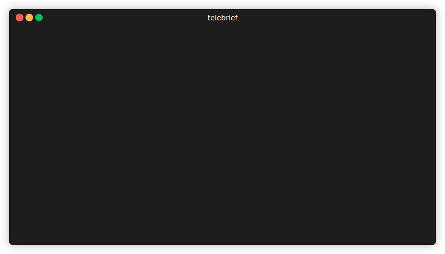

# 🚀 Telebrief




**Telebrief** - a modern tool for analyzing Telegram channels and calculating marketing metrics.

## Key Features

- 📈 **Metrics Calculation**: View-Rate, activity, engagement
- 🔍 **Deep Analysis**: Gini coefficient, percentiles, trends
- 📅 **Time Periods**: Analysis for any time period
- 📋 **Data Export**: JSON, CSV formats
- 🔧 **CLI Interface**: Convenient command interface
- 📚 **Library**: Use as a Python library

## 🏗️ Architecture

```
📦 telebrief/
├── 📂 telebrief/             # Main package
│   ├── 📂 core/              # Core functionality
│   │   ├── parser.py         # Telegram channel parser
│   │   ├── analyzer.py       # Metrics calculation engine
│   │   ├── exporter.py       # Data export (JSON, CSV)
│   │   └── __init__.py       # Core module exports
│   ├── 📂 models/            # Data models & types
│   │   ├── channel.py        # Channel and ChannelInfo classes
│   │   ├── post.py           # Post dataclass
│   │   ├── metrics.py        # Metrics dataclass
│   │   ├── constants.py      # Application constants
│   │   └── __init__.py       # Model exports
│   ├── 📂 utils/             # Utilities & helpers
│   │   ├── config.py         # Configuration management
│   │   ├── logger.py         # Logging system
│   │   ├── date_utils.py     # Date parsing utilities
│   │   └── __init__.py       # Utility exports
│   ├── cli.py                # Command-line interface
│   ├── __main__.py           # Entry point for uv run telebrief
│   └── __init__.py           # Main package exports
├── 📂 tests/                 # Test suite
│   ├── test_analyzer.py      # Analytics tests
│   ├── test_parser.py        # Parser tests
│   └── __init__.py           # Test utilities
├── 📂 examples/              # Usage examples
│   ├── example_usage.py      # Basic usage example
│   ├── analyze_from_file.py  # Batch analysis
│   ├── analyze_active_channels.py # Channel comparison
│   └── simple_channels.txt   # Sample channel list
├── 📂 .github/               # GitHub workflows
├── 📄 pyproject.toml         # Project configuration
├── 📄 justfile               # Development commands
├── 📄 README.md              # Project documentation
└── 📄 LICENSE                # MIT License
```

## 🚀 Quick Start

### Installation

```bash
# Clone and install
git clone https://github.com/TheQmaks/telebrief.git
cd telebrief

# Using uv (recommended)
uv sync

# Development installation with all extras
uv sync --all-extras
```

### CLI Usage

```bash
# Analyze one channel for 30 days
uv run telebrief bloomberg

# Analyze multiple channels for 7 days
uv run telebrief bloomberg,insiderpaper,realta_rent_il --days 7

# Load channels from file
uv run telebrief --channels-file channels.txt --days 7

# Limit number of posts (for active channels)
uv run telebrief bloomberg --days 30 --max-posts 100

# Export to CSV
uv run telebrief bloomberg --format csv

# Use proxy
uv run telebrief bloomberg --proxy 127.0.0.1:8081

# Analyze multiple periods
uv run telebrief bloomberg --periods 7,30
```

#### Channel File Format

Create a `channels.txt` file with channel names:

```text
# Simple channel names
bloomberg

# Channels with @ symbol
@insiderpaper

# Telegram URL's
https://t.me/Realta_Rent_IL

# Comments and empty lines are supported
# This is a comment
```

### Library Usage

```python
from telebrief import TelegramParser, MetricsAnalyzer, DataExporter
from telebrief.utils import Config

# Quick analysis
from telebrief import quick_analyze

result = quick_analyze('bloomberg', days=7)
print(f"View-Rate: {result['metrics']['average_vr_percent']:.1f}%")

# Detailed usage
config = Config()
config.add_channel('bloomberg')

# Parse channel
parser = TelegramParser(config)
channel = parser.parse_channel('bloomberg', days=30)

# Analyze metrics
analyzer = MetricsAnalyzer()
metrics = analyzer.analyze_channel(channel)

# Export results
exporter = DataExporter()
json_file = exporter.export_channel_json(channel, metrics=metrics)

print(f"View-Rate: {metrics.average_vr_percent:.1f}%")
print(f"Activity: {metrics.posts_per_day:.1f} posts/day")
print(f"Results saved: {json_file}")
```

## 📊 Metrics

Telebrief calculates 20+ analytical metrics:

### Basic Metrics
- `total_posts` - Number of posts in sample
- `avg_views_per_post` - Average number of views
- `median_views_per_post` - Median number of views

### View-Rate Metrics
- `average_vr_percent` - Average View-Rate (%)
- `median_vr_percent` - Median View-Rate (%)
- `percentile_90_vr` - 90th percentile VR
- `consistency_index_percent` - Content stability index

### Audience Activity
- `posts_per_day` - Publication frequency
- `active_subs_estimate` - Active audience estimate
- `activation_ratio_percent` - Activation ratio

### Content Quality
- `top_10_percent_share` - Share of top 10% posts by views
- `gini_coefficient` - Gini inequality coefficient
- `engagement_quality` - Qualitative engagement assessment

## 🔧 Configuration

```python
from telebrief.utils import Config

config = Config()

# Network settings
# In my case it was required for MITM and Telegram API debugging during development.
config.network.use_proxy = True
config.network.proxy_host = "127.0.0.1"
config.network.proxy_port = 8081
config.network.verify_ssl = False

# Parsing settings
config.parsing.default_days = 30
config.parsing.max_posts = 100

# Adding channels
config.add_channel('channel1')
config.add_channel('channel2')
```

## 📈 Output Example

```json
{
  "info": {
    "channel": "bloomberg",
    "name": "Bloomberg",
    "subscribers": 162268,
    "description": "The first word in business news.",
    "first_post_date": "2019-11-14T21:43:15",
    "channel_age_days": 2039
  },
  "posts": [
    {
      "post_id": "3063",
      "views": 19700,
      "date": "2025-06-13T00:46:47",
      "author": "bloomberg",
      "text": "Some post text..."
    },
    {
      "post_id": "3064",
      "views": 20100,
      "date": "2025-06-13T01:03:36",
      "author": "bloomberg",
      "text": "🚨 LIVE BLOG:..."
    },
    {
      "post_id": "3065",
      "views": 19100,
      "date": "2025-06-13T05:00:05",
      "author": "bloomberg",
      "text": "🚨 Here's the latest:..."
    }
  ],
  "metrics": {
    "total_posts": 4,
    "total_views": 74100,
    "analysis_period_days": 3,
    "avg_views_per_post": 18525,
    "median_views_per_post": 19400,
    "max_views": 20100,
    "min_views": 15200,
    "average_vr_percent": 11.42,
    "median_vr_percent": 11.96,
    "percentile_90_vr": 12.31,
    "percentile_75_vr": 12.2,
    "posts_per_day": 1.33,
    "active_subs_estimate": 19980,
    "activation_ratio_percent": 12.31,
    "top_10_percent_share": 27.13,
    "gini_coefficient": 0.05,
    "engagement_quality": "Average",
    "content_consistency": "High",
    "posting_frequency": "Medium"
  }
}
```

## 🛠️ Development

### Quick Commands

```bash
# Show all available commands
just

# Install development dependencies
just install-dev

# Sync dependencies from lock file
just sync

# Run tests
just test

# Format and check code
just pre-commit

# Analyze a channel for testing
just analyze bloomberg 7
```

## 📋 Requirements

- Python 3.11+
- requests >= 2.31.0
- beautifulsoup4 >= 4.12.0
- lxml >= 4.9.0
- html2text >= 2020.1.16

## 📄 License

MIT License - see [LICENSE](LICENSE) file.

---

*Made with ❤️ by Anatoliy Fedorenko* 